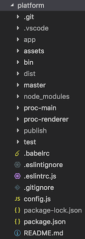
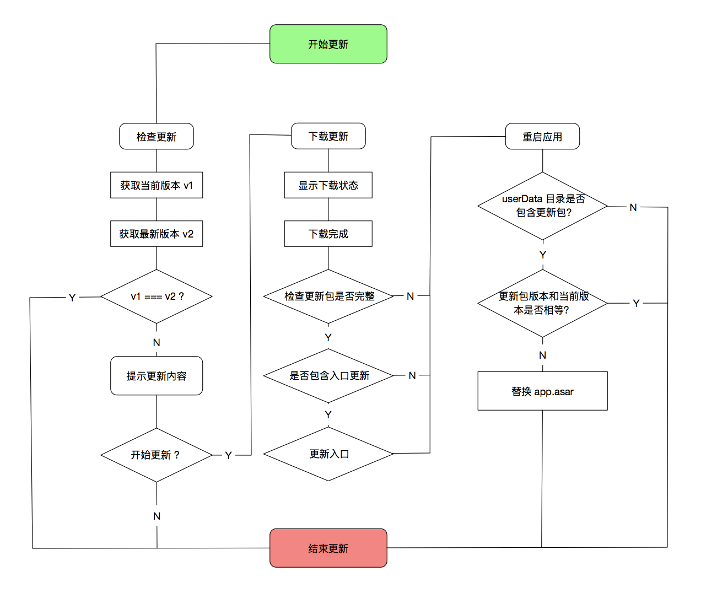

# 公寓管理平台 Electron 客户端

---

- [安装](#安装)
- [开发](#开发)
- [打包](#打包)
	- [MacOS 证书](#MacOS-证书)
	- [打包过程分解](#打包过程分解)
- [发布](#发布)
	- [publish 目录](#publish-目录)
	- [发布过程分解](#发布过程分解)
- [目录结构](#目录结构)
- [项目分支](#项目分支)
- [客户端版本](#客户端版本)
- [版本号](#版本号)
- [热更新](#热更新)
- [与子系统之间的通讯](#与子系统之间的通讯)
- [参考](#参考)

---

## 安装
1. 拉取项目：`git clone git@192.168.0.192:isz-pc/electron-client.git`
2. 安装依赖：`npm i`

	安装前最好设置淘宝源：
	`npm config set registry https://registry.npm.taobao.org/`

3. 拉取发布项目：`git clone https://gitee.com/ishangzu-fe/clients.git ./publish`
4. 安装 InnoSetup：`bin/exeConfigs` 目录下有，直接解压即可。

---

## 开发
启动使用以下命令：
`npm run dev`

需要注意的是：
1. 记得在 config.js 文件中指定开发服务托管的地址（主域名必须是 `ishangzu.com`），并在本地的 host 文件中配置。

---

## 打包

打包使用以下命令：
`npm run pack <version> <contentVersion>`

选项：
- version: 版本号
- contentVersion: 内容版本号

版本号规则参考：[版本号](#版本号)

需要注意的是：
1. 请按照提示完成每项任务
2. Windows 版本打包过程必须在 windows 系统（或虚拟机）中进行
3. 全局安装 <code>npm install -g asar</code>，切记! 切记! 切记! 重要的事情说三遍
4. electron-builder 下载相关依赖会遇到网络问题，解决办法请参考`https://github.com/electron-userland/electron-builder/issues/1859`
5. 打包时需下载指定的 Electron 版本，也有可能遇到网络问题，可以自己下载对应的 Electron 版本（[下载地址](https://npm.taobao.org/mirrors/electron/1.7.8/)）并放到各系统的默认缓存目录中，例如，MacOS 缓存目录是：`~/Library/Caches/electron` 。具体可参考：`https://github.com/electron-userland/electron-download`
6. Windows 下 exe 格式的安装包用到的配置文件，放置在 `bin/exeConfigs` 文件夹下，包含不同版本的安装包配置文件。打包的话，在系统中安装好 InnoSetup 之后，打开不同版本对应的配置文件，点击构建按钮即可。
7. electron-pdf-window.zip 需要覆盖本地的，不然打包会有问题 <b>记得改 package.json 的用户路径</b>([下载地址](https://github.com/ishangzu-fe/docs/blob/master/electron/electron-pdf-window.zip))

#### MacOS 证书
创建 MacOS 的安装包时需要进行代码签名，这时需要自己生成并安装证书，具体方法可参考：[MAS: Requesting certificates · nwjs/nw.js Wiki · GitHub](https://github.com/nwjs/nw.js/wiki/MAS%3A-Requesting-certificates)

#### 打包过程分解
打包过程主要分为以下几个步骤：
1. 检查版本号是否设置正确
2. 检查工作目录是否都已经提交
3. 确认环境配置，包括当前分支和发布的版本类型
4. 确认版本号
5. 更改版本号
6. webpack 打包
7. 生成 asar 文件
8. 生成 Windows 可执行文件
9. 生成 MacOS 可执行文件和安装包
10. 根据提示创建 exe 安装包

---

## 发布
发布使用命令：`npm run publish`

发布脚本会帮你将打好的包移至发布目录 publish 中，并在升级日志中写入升级信息。

完成后需执行命令提交发布的内容：`git push`

#### publish 目录
项目中的 publish 目录用于客户端的发布时使用，这是托管在[码云](http://git.oschina.net/ishangzu-fe/clients)的一个独立项目。其中包含这几个部分：
- dist：包含当前版本的客户端
- update.js：更新日志文件
- version.js：客户端下载页显示的版本号是从这里拿到的

所以发布版本前，请务必从[码云](http://git.oschina.net/ishangzu-fe/clients)拉取 publish 的内容，方法参考[安装](#安装)一节。

!> 需要特别注意的是，publish 目录是个独立的项目，它的不同分支代表着客户端不同版本存放的地址，比如正式版存放在 master 分支，所以打包时，config.js 文件中的 env 选项需要设置成 master，这样更新的时候，就会从 master 分支拉取更新日志文件；如果是测试版，是存放于 test 分支，打包时，config.js 文件中的 env 选项需要设置成 test，更新时，就会从 test 分支拉取更新日志文件。所以事实上，env 选项决定了更新时拉取更新日志文件的路径，在打包时，请务必确认 env 选项设置正确，这会在执行打包命令时提醒。

#### 发布过程分解
发布过程做了以下几件事情：
1. 将新的安装包移至 publish 目录
2. 根据用户输入生成新的更新记录并写入更新日志中
3. 更新版本文件（用于客户端下载页显示的版本号）
4. 提交内容并打上标签

注意：务必确认生成的更新记录以及版本文件无误后再同步到远程仓库

---

## 目录结构

主要包含以下目录：
- assets

	资源目录，包括图标、图片、字体和预载脚本等。

	webview 预加载脚本放在 assets 目录底下的 script 目录中。

- bin

	命令行脚本目录，包括打包和发布脚本，以及 webpack 和 InnoSetup 的配置文件等。

- master

	项目入口，项目从这里开始执行，主要负责热更新的文件覆盖这一步。

- proc-main

	主进程逻辑目录。
	其中 hooks 目录中，每个 js 文件，包含着文件名对应的生命周期执行逻辑。
	其中 modules 目录，是封装的一些功能模块。其中有用到的有：
	- download.js

		下载管理器的实现

	- env.js

		环境检查相关，目前只用于 ip 地址的检测

	- ipc-main.js

		设置 ipc 主进程监听的事件

	- menu.js

		菜单的设置

	- protocol.js

		协议模块，用于注册客户端监测的协议以及相应的逻辑

	- security.js

		安全模块，目前主要包含生成机器码的逻辑

	- tray.js

		通知栏图标模块，用于通知栏图标按钮的创建和菜单的配置等

	- update.js

		升级模块

	- window.js

		用于创建应用窗口，包括登录窗口、平台窗口和关于窗口

- proc-renderer

	渲染进程逻辑目录。
	其中 windows 目录包含应用不同窗口可视界面的代码，分为 Login、panel、platform。
	- Login

		包含登录界面的代码。

	- Panel

		包含关于面板界面的代码。

	- Platform

		包含平台界面的代码。

- publish

	发布目录，包含发布时的独立应用，具体参考 [publish 目录](#publish-目录)。

- config.js

	用于配置本地的开发环境。其中：
	- env 选项代表当前的版本，开发和正式环境都有用到。可选值有：
		- master: 代表正式版本，只有打包和正式版本时候需要用到。
		- test: 代表测试版本，测试时或者平时开发时，设置成 test 就对了。
	- Host，代表开发服务托管的地址，务必以 `ishangzu.com` 结尾，以保证页面的 cookie 设置正常。

---

## 项目分支
项目分支采用 [Gitflow 模型](/standard/git.md)：
- master: 主分支，仅包括发布的版本
- dev: 开发分支
- feature-…

---

## 客户端版本
客户端分为三个版本：
- 线上版本：用于线上环境
- 测试版本：用于测试和预发环境
- 开发版本：供中后台开发者使用

需要注意的是：
1. 测试版本只能运行在测试和预发环境中使用，这会在登录时进行检测
2. 打包时请确认版本设置正确，是在 config.js 中通过 env 变量来区分的：
	- 线上版本 -> master
	- 测试版本 -> test
	- 开发版本 -> dev

---

## 版本号
项目版本号分为：

- 项目版本号（version）：项目版本，通过 package.json 中 version 来指定
- 内容版本号（contentVersion）：热更新包的版本，通过 package.json 中 meta.contentVersion 来指定

**项目版本号**采用 semver 版本号规范，与通常的 npm 包版本号规则相同。

**内容版本号**一般与项目版本号相同，只是将点 ‘.’ 去掉。例如：主版本号为 2.1.14 ，则内容版本号为 2114。

**测试版本号**可以通过内容版本号来与正式版本号区分，一般提测时会指定内容版本为 21140，若有更新，递增末位数字，例如 21141, 21142…

---

## 热更新原理
热更新流程如图：

热更新采用了常见的方案，简单来说，就是先检查版本，如果有更新就从远程拉取新版本覆盖旧版本。

所以，热更新过程可以分为：
1. 检查更新
2. 下载更新
3. 替换文件

代码分别分布在以下文件中：
1. 检查和下载的逻辑代码：proc-main/modules/update.js
2. 界面代码：proc-renderer/windows/login/components/update.vue
3. 替换文件的逻辑代码：master/update-local.js

此外，我们创建的更新包放在[码云](http://git.oschina.net/ishangzu-fe/clients)，其中除了更新包，还有完整的客户端，日志更新文件，其中包含版本号和对应的更新记录。

下面讲讲每个步骤具体是怎么做的：
1. 检查更新

	首先会向码云请求包含更新记录的文件，获取到最新的版本号与本地的 package.json 中的 meta.contentVersion 字段进行比对，如果不同，就视为有新的版本，这样可以很容易实现版本的回退。
	更新记录还包括一个 entry 字段，代表是否包含入口更新。什么是入口更新？项目代码打包时会生成两个 bundle，一个是 master.asar，一个是 app.asar，app.asar 包括应用的主要代码，master.asar 只包含 master 目录下的代码（包含更新替换步骤的代码），master.asar 就被视为项目的入口。
	普通更新只会更新 app.asar 文件，如果我们把 entry 字段设为 true，则代表需要更新 master.asar。

2. 下载更新

	下载更新只是从码云下载了一个压缩包并解压，存放于项目的 AppData 目录下（可以通过 app.getPath(‘appData’) 方法来获取每个系统下默认的应用数据目录）。
	下载完成后，会将更新包的 MD5 值和更新记录中的 MD5 值进行比对，防止下载包损坏的现象。
	如果下载成功，会立即重启应用。如果包含入口更新，会先执行更新包中包含的更新脚本文件，利用它来更新 master.asar 文件，完成后会立即重启应用。

3. 替换文件

	替换文件发生在项目的一开始。打开的时候会检查应用的 AppData 目录下是否包含更新包，如果有会再比对版本号，如果更新包的版本号与本地版本号不同，就会视为有更新。
	替换文件时可能会出现需要权限的问题，不同的系统，我们请求权限的方案是不同的。在 Windows 下，我们利用 cmd+vb 来请求管理员权限；在 MacOS 下，我们利用了第三方模块 sudo-prompt 来实现。

- - - -

## 与子系统之间的通信
与子系统之间的通信包括：
1. 父 -> 子
2. 子 -> 父
3. WebSocket

其中父指的是客户端，子指的是包括 erp 在内的所有子系统。

子系统在客户端存在的形式是一个个 webview 标签，一个webview 标签是一个独立的渲染器进程，所以与 webview 通信就是进程间通讯的实现。

webview 介绍参考：[webview 标签 | Electron](https://electronjs.org/docs/api/webview-tag)

1. 父 -> 子
	客户端向子系统发送信息有这几种方式：

	- webview.send()

		webview.send() 方法通过 ipc 向 webview 进程发送消息，具体方法参考：[webview 标签 | Electron](https://electronjs.org/docs/api/webview-tag#webviewsendchannel-arg1-arg2-)。

		而 webview 页面进程需要监听客户端发送的消息，可以通过 ipcRenderer.on() 方法来实现。

		这是父子间通信的最佳实践。

	- Cookie

		Cookie 的方式不必多说，electron 对 cookie 的读写有完全的控制权，具体方法可参考：[Cookies | Electron](https://electronjs.org/docs/api/cookies)。

		注意，这种方式并不是响应式的，即子系统必须去主动地查看 cookie 是否发生改变。

	- url

		Webview 的 src 属性接受一个 url 代表页面的地址，我们可以通过 URL 查询字符串来传递信息。

		注意，这种方式会使子系统刷新。

2. 子 -> 父
	子系统向客户端发送信息有这几种方式：

	1. 协议请求

		协议请求指的是父子系统之间通过自定义的协议来进行通信。

		比如 Erp 需要在客户端预览 PDF，就可以发送一个信号（Get 请求）给 preview://文件地址。客户端只需要注册并监听 preview 协议头的请求，拦截后通过插件打开 PDF 预览窗口即可实现 PDF 的预览。

	2. ipcRenderer.sendHost()

		ipcRenderer.sendHost() 可以在 webview 进程内发送信息给外部宿主的 Renderer 进程。

3. WebSocket 与 IPC 的方式实现类似，不再赘述。

- - - -

## 参考
- Electron 基础
	- [文档](https://electronjs.org/docs)
